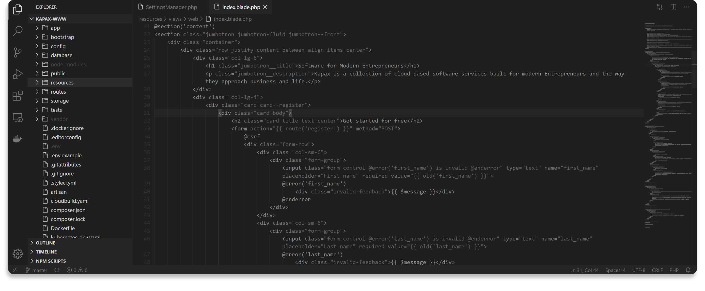
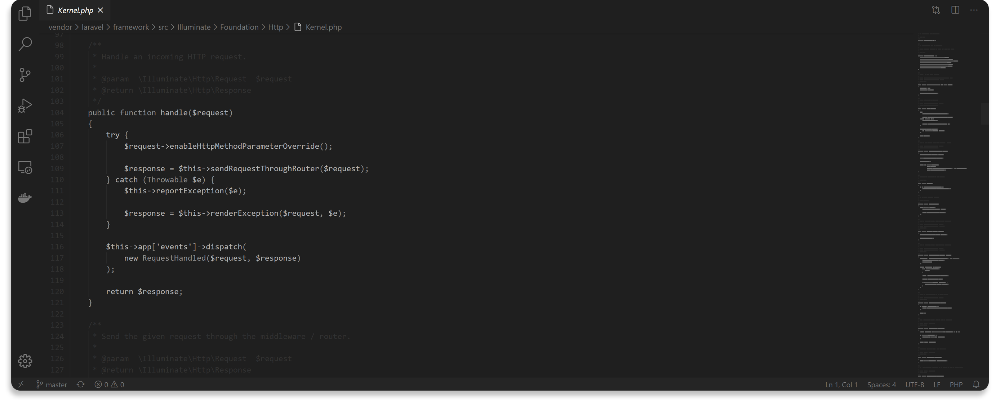

A neutral, clean, and professional theme for Visual Studio Code created by <a href="https://www.kapax.pro">Kapax</a>.

## Installation
Easily install this theme by visiting the [Visual Studio Code Marketplace](https://marketplace.visualstudio.com/items?itemName=Kapax.pro-dark-visual-studio-code) on the web or through the extensions tab of Visual Studio Code.

## HTML

## Markdown

## JavaScript

## PHP
